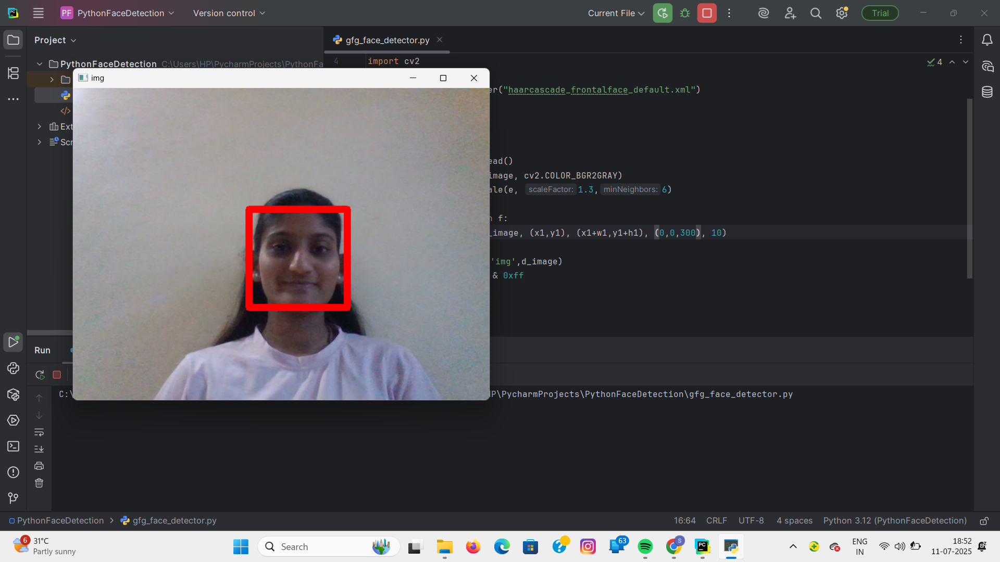

# 🧠 Face Detection Using OpenCV

A simple real-time face detection project using Python and OpenCV. It captures video from your webcam and detects human faces using Haar Cascade Classifier.

---

## 📸 Demo Screenshot
  
> 

---

## 🚀 Features

- Real-time face detection using webcam.
- Uses Haar Cascade Classifier from OpenCV.
- Draws a green rectangle around detected faces.
- Press `x` to close the detection window.

---

## 🛠️ Tech Stack

- **Language**: Python 3.x  
- **Libraries**: OpenCV (`opencv-python`)  
- **Tools**: PyCharm  
- **Hardware**: Laptop/PC webcam

---

## 📁 Project Structure

PythonFaceDetection/
│
├── gfg_face_detector.py # Main Python script
├── haarcascade_frontalface_default.xml # Haar cascade file
├── README.md # This file
└── venv/ # (optional) virtual environment

---

## 📦 Installation & Setup

1. **Clone or Download the project**
   ```bash
   git clone https://github.com/yourusername/FaceDetection.git
   cd FaceDetection
python -m venv venv
venv\Scripts\activate  # For Windows
pip install opencv-python

## Download Haar Cascade File

Download from:
Click here to download

Save it in the same folder as your .py file.

python gfg_face_detector.py
Press x to exit the video window.

🧠 Code Snippet

e = cv2.CascadeClassifier('haarcascade_frontalface_default.xml')
f = e.detectMultiScale(gray_image, scaleFactor=1.3, minNeighbors=6)

✅ Requirements

- Python 3.x
- OpenCV (install using pip install opencv-python)
- Webcam

  🙋‍♀️ Author
  
Sanika Ingole
Bachelor of Engineering – Electronics and Telecommunication
-🎓 Sipna College of Engineering and Technology, Amravati
-💼 LinkedIn: [www.linkedin.com/in/sanika-ingole-1aa0a5259]
-📧 Email: [sanikaingole111@gmail.com]


